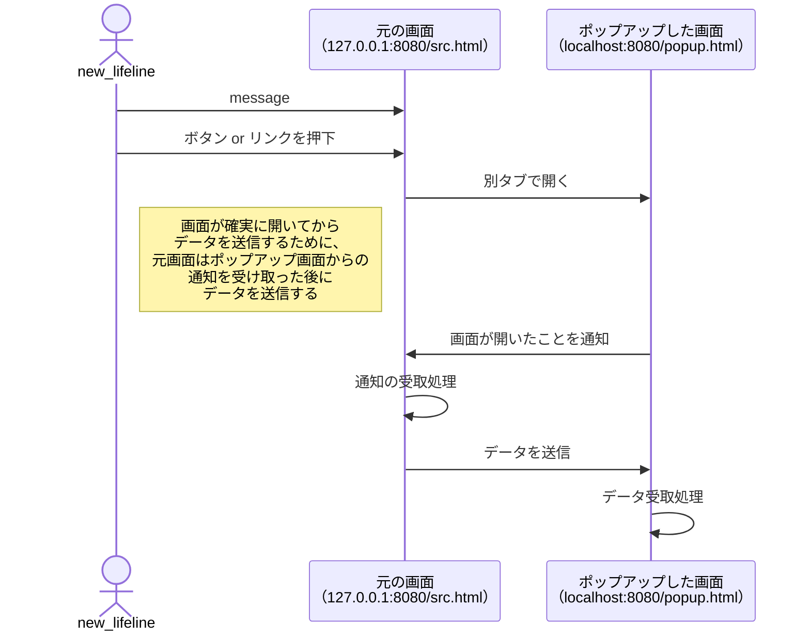

# postMessageを使って、ブラウザ上でオリジン間のデータ共有を実施 の写経

## postmessage-sample
PostMessageによる、異なるオリジン間での通信のサンプルです。
https://github.com/k-ibaraki/postmessage-sample

こちらの記事で書いたものです。
https://zenn.dev/ncdc/articles/49098d7d16f8ee

## 使い方

1. http-serverを立ち上げてください
```
npx http-server
```

2. ブラウザから、`http://127.0.0.1:8080/src.html`に接続してください。
3. 適当にテキストを入力して、`別タブで開く`を押下。
4. 入力したテキストが、開いた別タブに連携されます。

## 処理の流れ
Mermaid Graphical Editor で書きました。

